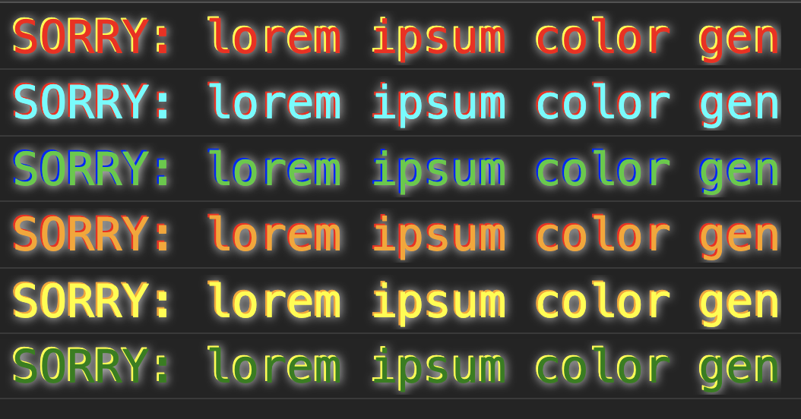

# Console.sorry()

This landscape-altering, paradigm-shifting library provides web developers a new way to express their inner-canadian wholesomeness. Apologize for your code, _in_ your code. To use it, import the library with a script tag in your header. Then `console.sorry` your way to forgiveness.

```js
console.sorry('I don\'t know why I did this, but I will do better. I promise.')
```

Your frank apologies will appear in the console in all manner of randomly-selected, shame-appropriate colors:



